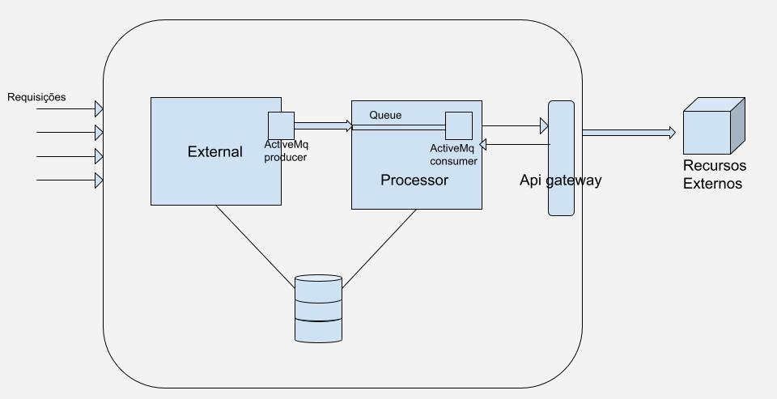

# Aplicação do Desafio 3 da Compass

Este repositório contém a aplicação desenvolvida para o terceiro desafio da Compass. Nesta implementação, optei por utilizar o banco de dados embutido H2 e para a mensageria, escolhi o ActiveMQ Artemis, também embutido na própria aplicação.

## Estratégia Utilizada

A estratégia adotada na aplicação visou otimizar o processamento das requisições POST, permitindo que a aplicação recebesse as requisições sem a necessidade de processar uma antes de receber a próxima.

A cada requisição POST realizada, um objeto de Post vazio é criado, com o status "CREATED", e é então enfileirado na fila do ActiveMQ Artemis. No lado do consumidor, que está escutando a fila, cada objeto que aparece é processado, preenchido com comentários e atualizações do status no histórico do Post.

## Fluxo da Aplicação

O fluxo da aplicação é ilustrado no diagrama abaixo, que descreve razoavelmente a comunicação entre os diferentes pacotes:

## Como Executar

Para executar a aplicação:

1. Clone este repositório.
2. Inicie a aplicação, que escuta na porta 8080.
3. Acesse a aplicação via URL.

